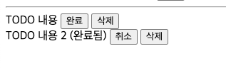

# TODO CRUD

간단한 CRUD를 하는 연습입니다. 할일 목록을 의미하는 TODO CRUD를 진행해 보세요.

## 세부 사항

### [`TodoDto.java`](src/main/java/com/example/todo/model/TodoDto.java)

```java
public class TodoDto {
    private Long id;
    private String content;
    private Boolean done;
    
    // ...
}
```

CRUD의 대상인 `TodoDto` 입니다. `content`는 할일을 나타내는 문구가, `done`에는 완료 여부를 나타내는 `Boolean` 데이터가 들어갑니다.

### [`todo.html`](src/main/resources/templates/todo.html)

`todo.html`에는 기본적인 UI가 어떻게 보일지에 대한 예시가 작성되어 있습니다.
이번 프로젝트에서는 `todo.html`에서 CRUD가 전부 진행됩니다.

```html
<form>
  <label for="todo-desc">새 할일: <input type="text" id="todo-desc">
  </label>
  <input type="submit" value="생성">
</form>
```

사용자에게 할일을 입력받는 부분입니다. 생성을 누르면 새로운 할일이 목록에 추가됩니다.


```html
<!-- 완료되지 않은 할일 -->
<div>
  TODO 내용
  <form>
    <input type="submit" value="완료">
  </form>
  <form>
    <input type="submit" value="삭제">
  </form>
</div>
<!-- 완료 된 할일 -->
<div>
  TODO 내용 2 (완료됨)
  <form>
    <input type="submit" value="취소">
  </form>
  <form>
    <input type="submit" value="삭제">
  </form>
</div>
```

할일 목록이 보이는 모습입니다. 
`TodoDto.done`의 값에 따라서 `content` 와 `content (완료됨)`의 형태로 달리 표기되며,
옆의 첫번째 버튼의 표기값도 변경됩니다. 완료 버튼과 취소 버튼 모두 같은 URL로 요청을 보냅니다.

삭제를 누를경우 목록에서 제거됩니다.




### [`TodoController.java`](src/main/java/com/example/todo/TodoController.java) & `TodoService.java`

요청을 받는 `TodoController`입니다. 
`todo.html` View를 반환하는 메소드는 이미 만들어져 있습니다.
그 외 `create()`, `update()`, `delete()`를 완성해야 합니다.
이때, 모든 URL은 `/todo/`로 시작될 수 있게끔 작성합니다.

```java
@Controller
public class TodoController {

    // ...

    public String create() {
        // 새로운 TODO를 생성하는 컨트롤러 메소드
        throw new RuntimeException("TODO");
    }

    public String update() {
        // TODO의 done 상태를 변경하는 메소드
        throw new RuntimeException("TODO");
    }

    public String delete() {
        // TODO를 삭제하는 메소드
        throw new RuntimeException("TODO");
    }

    // ...
}
```

이중 `update()`의 경우, 완료되지 않은 할일의 `완료` 버튼, 완료된 할일의 `취소` 버튼 두 버튼 모두에 대해 반응합니다. 
**Post/Redirect/Get** 패턴을 기억하며 어떻게 동작해야 할지 고민해 봅시다.
`TodoService.java` 의 경우 특별히 구현된 부분이 없습니다. 자유롭게 구현하면 됩니다.

```java
@Service
public class TodoService {
    // 필요한 Service 메소드를 자유롭게 구성합니다.
}
```

### 그외

제약사항은 없습니다. 이미 작성된 코드를 삭제하더라도 요구된 기능이 동작한다면 무관합니다. 

